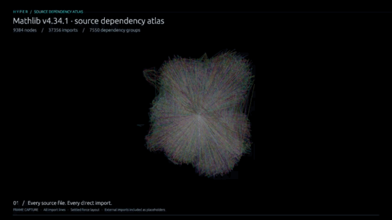

# hyper

**hyper** provides native 3D hypergraph exploration for **Python scientific
workflows** and **embedded Rust applications**. Explore explicit group memberships
with picking, search, lasso selection, and neighborhood isolation.

The Rust core provides HIF interchange, projections, and force-directed layout
without Bevy. The typed Python package exposes HIF interchange and can launch
the separately installed native viewer. Use scientific libraries for analysis
and Hyper to explore their exported datasets.

[](docs/media/mathlib.mp4)

**[Watch the full-resolution Mathlib demo](docs/media/mathlib.mp4)** — the complete source-file
import graph of mathlib v4.34.1, rendered at 1080p. Includes 9,112 source files
and 272 external-module placeholders. The video uses a settled layout;
[reproduction instructions and live benchmarks](docs/mathlib-demo.md) explain
the workload and rendering limits.

## Choose a workflow

| Workflow | Entry point |
|---|---|
| Exchange scientific datasets from Python | `hyper_viz.HifDocument`: load, validate, retain metadata, and export HIF |
| Explore a dataset in a native 3D window | `hyper` CLI or Python `hyper_viz.show()` |
| Embed projections and layout in a Rust application | Bevy-free `hyper-viz` library and render-independent scene |
| Embed the native viewer in a Rust host | `hyper-viz-bevy` plugin and live scene channel |

Inputs include scientific **HIF**, native **`hypergraph.v1`** JSON, and supported
legacy exports. The model is domain-agnostic: vertices, hyperedges, and memberships.

## Python and scientific interoperability

Start with [uv](https://docs.astral.sh/uv/getting-started/installation/) to manage
Python and the project environment:

```bash
uv init --python 3.12 hyper-example
cd hyper-example
uv add "hypergraph-viz[viewer]"
uv run hyper
```

This opens the built-in coauthorship demo. To view your own HIF dataset:

```bash
uv run hyper dataset.hif.json --projection bipartite
```

To launch only the desktop viewer without creating a project:

```sh
uvx --python 3.12 --from hypergraph-viz-viewer hyper
# Open your dataset:
uvx --python 3.12 --from hypergraph-viz-viewer hyper dataset.hif.json
```

`--from` selects the distribution that supplies the `hyper` executable.
`hypergraph-viz` supplies the Python API and has no executable of its own;
use `uv add "hypergraph-viz[viewer]"` for Python integration in a project.
See [uv's tool guide](https://docs.astral.sh/uv/guides/tools/).

`uv add` records dependencies in `pyproject.toml`, creates `.venv`, and locks
versions in `uv.lock`; `uv run` uses that environment without activation.
uv can download Python 3.12 if needed, avoiding older system or Xcode Python.
See the [uv project guide](https://docs.astral.sh/uv/guides/projects/).
For interchange alone, use `uv add hypergraph-viz` without the viewer extra.

The distribution is **`hypergraph-viz`**; the import name is **`hyper_viz`**.
Requires **CPython 3.10+**. Wheels cover Linux x86_64, macOS arm64/x86_64,
and Windows x86_64; a compatible wheel requires no Rust compiler.
The viewer needs a desktop session and graphics driver. Linux desktop wheels
require glibc 2.28+; macOS targets 11.0+.

If you prefer pip, use a virtual environment with Python 3.10+:

```bash
python -m pip install --upgrade "hypergraph-viz[viewer]"
```

Use `python -m pip install hypergraph-viz` for interchange alone. Upgrading pip
does not upgrade Python; check `python --version` if no matching distribution is found.
Rust is needed only for source builds.
For a Python development build from this checkout with **Rust 1.89+**:

```bash
python -m venv .venv
. .venv/bin/activate # Windows: .venv\Scripts\activate
python -m pip install maturin==1.9.6
cd crates/hyper-viz-python
maturin develop --locked
cd ../..
```

```python
import hyper_viz

document = hyper_viz.HifDocument.load("dataset.hif.json")
document.save("roundtrip.hif.json")
print(document.to_json())

# Install hypergraph-viz[viewer] first.
viewer = hyper_viz.show(document, projection="bipartite")
exit_code = viewer.wait() # or viewer.close() to terminate
```

Save the Python example as `explore.py` alongside `dataset.hif.json`, then run
`uv run explore.py` in your project.

Pass `executable="/path/to/hyper"` to select a viewer explicitly. Otherwise the
launcher finds the matching companion package, then `hyper` on PATH. The launcher
validates compatibility, starts the process asynchronously without a shell, and
owns a temporary native snapshot that is cleaned up after exit. The Python
extension itself does not depend on Bevy or download a viewer.

Keep the `HifDocument` for scientific export: it preserves JSON values, record
order, metadata, integer/string ID identity, isolated nodes, empty edges, and
incidence properties. Whitespace and object-key order are not preserved.
Validation uses a bundled, pinned schema and works offline.

**Document interchange supports more semantics than the viewer.** Viewer
conversion accepts undirected memberships and rejects directed or simplicial
semantics, incidence direction, weights, or attributes, and duplicate identities
or memberships. Node/edge weights round to finite `f32` for viewing; original
numbers remain in the document. Validation and compatibility exceptions expose
`location` and `reason`. Retained attributes are not automatically mapped to
viewer colors or exposed by the stock inspector.

See [HIF and Python integration](docs/HIF.md) for API details, generated typing,
wheel builds, and runnable [XGI](crates/hyper-viz-python/examples/xgi_interop.py)
and [Julia](examples/hif_interop.jl) interchange examples. Direct scientific
object adapters, notebook embedding, layout bindings, and live updates from
Python are deferred. The [notebook prototype roadmap](docs/NOTEBOOK_ROADMAP.md)
sets out an anywidget canvas probe and Bevy/WASM feasibility checks.

## Ecosystem fit and measured findings

Hyper complements scientific analysis libraries and offers a Rust/native route
to exploring groups. The ecosystem comparison suggests this positioning; user
preference and adoption have not been measured.

| Tool family | Fit alongside Hyper |
|---|---|
| XGI, HyperNetX, Hypergraphx | Scientific analysis and figures; exchange datasets through HIF where semantics are compatible |
| HyperGodot | Dedicated interactive 2D hypergraph exploration; an alternative when a 2D workflow fits |
| Sigma.js, Cytoscape.js, 3d-force-graph | Browser graph components; represent groups through incidence adapters and custom drawing |
| Graphia, Gephi | General graph analysis and attribute-driven exploration; useful references for richer inspection and filtering |

The [October 3, 2026 benchmark](docs/benchmarks/ecosystem-2026-10-03/README.md)
records **445 measured attempts across 89 configurations** on one Apple M5 Pro
Mac. Scientific figures, browser rendering, native rendering, and import/save
workflows are separate tracks; these results do not establish an overall speed
ranking or native-versus-browser speed advantage.

| Finding | Evidence and implication |
|---|---|
| Dense hulls are expensive | For 1,000 nodes / 2,000 groups in frozen bipartite mode, median per-run p95 application interval rose from **9.68 ms** without hulls to **62.08 ms** with hulls; both completed 5/5 attempts. Profile geometry and update costs before adding visual effects. |
| A successful demo is not a capacity guarantee | Full Mathlib bipartite runs completed 0/5 attempts within the 180-second budget in each frozen mode. Star mode with hulls and the default label policy completed 5/5, but frozen p95 was **219.91 ms**. Projection and settings change both work and responsiveness. |
| Failures need investigation | **16/120 native attempts** did not complete, including a small fixture. Completed-run timings exclude those failures; their cause remains unresolved. |
| Model fidelity must be checked | XGI preserved every tested model record. Our HNX adapter omitted isolated nodes and empty groups; HGX merged parallel groups by membership. Keep the original HIF document and validate adapter boundaries. |
| Smooth navigation does not guarantee fast updates | Sigma completed all 35 browser attempts, but its Mathlib update command took **13.24 s**. Update strategies differed across tools; evaluate updates separately from camera motion. |

Application intervals and browser callback cadence are not GPU timings or
input-to-visible latency. Hulls approximate large groups, representations differ,
and display refresh was not locked across browser batches. Read the
[method and limitations](docs/benchmarks/ecosystem-2026-10-03/methodology.md),
[raw results](docs/benchmarks/ecosystem-2026-10-03/summary.csv), and
[rerun instructions](scripts/benchmarks/README.md) before interpreting timings.

The next priorities are **attribute inspection and filtering**, **measured
responsiveness during dense geometry updates**, and **easier installation with
accurate documentation**. The [community and ecosystem research](docs/ecosystem-comparison.md)
explains the evidence behind those priorities. Browser distribution, directed
rendering, and timeline views remain outside the current viewer scope.

## Docs for external readers

| Doc | Contents |
|---|---|
| [docs/ARCHITECTURE.md](docs/ARCHITECTURE.md) | Package boundary, host coupling policy |
| [docs/API.md](docs/API.md) | Library API overview |
| [docs/VIEWER.md](docs/VIEWER.md) | How to run the viewer + example scene |
| [docs/HIF.md](docs/HIF.md) | Scientific interchange, Python API, supported semantics, and packaging |
| [Measured ecosystem comparison](docs/benchmarks/ecosystem-2026-10-03/README.md) | Results, completion counts, raw evidence, and limitations |
| [Community and ecosystem research](docs/ecosystem-comparison.md) | Positioning and roadmap evidence |
| [Notebook prototype roadmap](docs/NOTEBOOK_ROADMAP.md) | Small-dataset anywidget plan and WASM feasibility checks |
| [Python release guide](docs/PYTHON_RELEASE.md) | PyPI Trusted Publisher setup and tag-based releases |
| [docs/PUBLIC_RELEASE_CHECKLIST.md](docs/PUBLIC_RELEASE_CHECKLIST.md) | Maintainer release-decision checklist |
| [CONTRIBUTING.md](CONTRIBUTING.md) | Dev setup and PR norms |

## Use as a library

```toml
# Headless: schema, JSON, projections, 3D layout (no Bevy)
hyper-viz = { git = "https://github.com/atomicstrata/hyper.git" }

# Optional native 3D window
hyper-viz-bevy = { git = "https://github.com/atomicstrata/hyper.git" }
```

Path dep while this repo sits next to the host:

```toml
hyper-viz = { path = "../hyper/crates/hyper-viz" }
hyper-viz-bevy = { path = "../hyper/crates/hyper-viz-bevy" }
```

`hyper-viz` has **no Bevy dependency**. Embed it in a WASM, SVG, or custom renderer.

### Headless

```rust
use hyper_viz::prelude::*;

let graph = Hypergraph::new()
    .with_title("Reactions")
    .vertex("h2o", "H2O", "molecule")
    .vertex("h2", "H2", "molecule")
    .vertex("o2", "O2", "molecule")
    .hyperedge("combust", ["h2", "o2", "h2o"], "2H2 + O2 → 2H2O");

let scene = graph.project(Projection::Bipartite);
let mut layout = ForceLayout3D::from_scene(&scene, LayoutConfig::default());
layout.step();
```

Load JSON (automatic HIF, native, or supported legacy format detection):

```rust
use hyper_viz::{from_json_str, load_json};

let graph = load_json("fixtures/sample.json")?;
let graph = from_json_str(r#"{"version":"hypergraph.v1","vertices":[],"hyperedges":[]}"#)?;
```

A quarantined one-way importer can still load a legacy host export prefix; it is
**not** part of the public domain model (see architecture docs).

### Native viewer

```rust
use hyper_viz_bevy::{run_from_graph, run_visualizer, run_visualizer_live};

run_from_graph(graph);              // bipartite + blocking window
run_visualizer(scene);              // already projected
run_visualizer_live(scene, rx, None); // host thread pushes scenes
```

A new scene on the live channel (or a file-watch reload) rebuilds the scene
while retaining positions by stable ID and remapping surviving selection and
focus. Invalid watched input leaves the previous scene visible.

### Embed in a Bevy app

```rust
use bevy::prelude::*;
use hyper_viz_bevy::HyperVisualizerPlugin;

App::new()
    .add_plugins(DefaultPlugins)
    .add_plugins(HyperVisualizerPlugin::from_scene(scene))
    .run();
```

`VisualizerConfig` sets window title and size for the standalone helpers.
Pass `Some(shutdown_flag)` to `run_visualizer_live` so a host thread can exit
the Bevy app.

## Crate map

```text
HIF JSON → HifDocument → compatibility check
Native JSON / Rust builder API
  → Hypergraph
  → project(Bipartite | Clique | Star)
  → HypergraphScene     # render-agnostic IR
  → ForceLayout3D       # Barnes-Hut octree, CPU
  → hyper-viz-bevy      # native 3D window (optional)
```

| Crate | Role | Depend on this? |
|---|---|---|
| [`crates/hyper-viz`](crates/hyper-viz) | HIF, scene IR, projections, layout, hulls, JSON I/O | **Yes** — library |
| [`crates/hyper-viz-bevy`](crates/hyper-viz-bevy) | Bevy 0.18 + egui native viewer | Only if you want the window |
| [`crates/hyper-viz-python`](crates/hyper-viz-python) | Typed Python HIF bindings and viewer launcher; no Bevy | For Python workflows |
| `hyper` (this binary) | CLI: load JSON or open the built-in demo | No — not a library |

## Quick start (CLI)

```bash
# Built-in coauthorship demo
cargo run

# Example scene
cargo run -- fixtures/sample.json

# Scientific HIF dataset (also auto-detected without --format)
cargo run -- dataset.hif.json --format hif

# Hot-reload while you edit the file
cargo run -- --watch fixtures/sample.json

# Other projections: bipartite (default), clique, star
cargo run -- --projection clique fixtures/sample.json

# Headless library example (no window)
cargo run -p hyper-viz --example project_scene
```

Requires Rust 1.89+. The first Bevy build can take several minutes, depending
on the machine. For regular use, build with `cargo build --release --bin hyper`
or install with `cargo install --path . --locked`. See [docs/VIEWER.md](docs/VIEWER.md)
for native viewer setup.

## JSON schema (`hypergraph.v1`)

```json
{
  "version": "hypergraph.v1",
  "meta": { "id": "g1", "title": "Coauthorship" },
  "vertices": [
    { "id": "alice", "label": "Alice", "kind": "person" },
    { "id": "bob", "label": "Bob", "kind": "person" },
    { "id": "carol", "label": "Carol", "kind": "person" }
  ],
  "hyperedges": [
    { "id": "paper-a", "label": "Paper A", "vertices": ["alice", "bob", "carol"] }
  ]
}
```

| Field | Required | Notes |
|---|---|---|
| `vertices[].id` | yes | Stable id referenced by hyperedges |
| `vertices[].label` | no | Falls back to `id` |
| `vertices[].kind` | no | Free-form; used only for color |
| `vertices[].status` | no | `active` (default), `shadowed`, `rejected`, `attention` |
| `hyperedges[].vertices` | yes | Member vertex ids |
| `hyperedges[].status` | no | `active` (default), `shadowed`, `rejected`, `attention` |
| `*.attrs` | no | Opaque JSON map for the host app |

## How the graph is drawn

Default projection is **bipartite** (one extra-node hub per hyperedge). The
viewer hides those hubs by default so the hyperedge is read as a **set**:

| Arity | Drawing |
|---|---|
| 2 | Colored line between the two members |
| 3 | Triangle hull |
| 4 | Tetrahedron hull |
| 5+ | Convex hull, using at most 24 sampled members |

Large-group hulls are approximate: the geometry cap does not remove memberships
from the graph, and a hull is not an exact membership boundary. Empty edges have
no drawable geometry.

Each hyperedge keeps a **stable hue** from its id (hash), so nested sets stay
distinguishable. Nested hulls are inflated slightly to avoid z-fighting.
Vertex color comes from `kind` (fixed palette for well-known names, hash otherwise).

Uncheck **Hide extra-node hubs** in the Hyperedge hulls panel to show the
bipartite hubs as spheres.

## Controls

Left button is dual-purpose. **Drag** orbits; **click** (press + release with
almost no movement) selects. Orbiting does not change selection.

| Input | Action |
|---|---|
| Left drag | Orbit camera (selection is kept) |
| Left click | Select the vertex or hyperedge under the cursor |
| Click empty space | Clear selection |
| Shift / Cmd + click | Add to selection |
| Scroll | Zoom (HUD windows steal scroll when the pointer is over them) |
| Lasso (UI panel) | Polygon select (disables orbit while on) |
| Space | Toggle force layout |
| A | Isolate `attention` status: hide other hulls, boost remaining fills, label those nodes |
| F | Frame camera (ignored while the find bar is focused) |
| ⌘F / Ctrl+F | Focus the find bar |
| ⌃⌘F | Isolate the selected incident neighborhood (toggle) |
| / | Focus the find bar (when not typing) |
| Enter (in find) | Isolate the match neighborhood and frame the camera |
| Esc | Clear the find query, or clear focus |
| Clear selection | Button in the Selection window |

The find bar at the bottom highlights matches as you type (BM25 + Jaro–Winkler
on label, id, kind, and status). Hits use the existing selection glow and the
**Selection** window. While focus is on, each new query also re-isolates the
match neighborhood and reframes the camera.

The **Selection** window lists selected hyperedges and vertices with kind,
label, status, and a location taken from the id (`repo:…`, `wt:…`, `pr:…`).
Click a row to narrow the selection to that node. Pointer over any HUD window
does not orbit or zoom the scene.

Picking hits vertices, hull triangles, and arity-2 segments. Hidden hubs are
not pickable.

## Hover vs selected

Both states keep the object's own hue. They do **not** swap to a highlight
color.

| State | Look |
|---|---|
| Hover | Nodes grow slightly; hull/line wires brighten |
| Selected | Same hue, higher saturation and glow |
| Hover + selected | Selected treatment wins (still a bit larger) |

## Projections

- **Bipartite** (default): one hub node per hyperedge + incidence links (Ouvrard extra-node).
- **CliqueExpansion** (`--projection clique`): all pairs within each hyperedge (no hubs).
- **StarCentroid** (`--projection star`): centroid attraction, no hub nodes.

## Tests

```bash
cargo test -p hyper-viz
cargo test -p hyper-viz-bevy --lib
cargo clippy -p hyper-viz -p hyper-viz-bevy --all-targets -- -D warnings
```

## Observability

JSON-friendly `tracing` logs on scene init, file-watch reload, and live-channel
reload (`nodes`, `hyperedges`, `graph_id`). Set `RUST_LOG=hyper_viz_bevy=info`
(see [`.env.example`](.env.example)).

No secrets. The viewer restores HUD, navigation (lasso), camera pose,
selection, focus neighborhood, and find query from a `hyperviz.session.v1`
JSON blob:

| Host | Where |
|---|---|
| Desktop | `~/Library/Application Support/hyper-viz/session.json` (macOS), `%APPDATA%/hyper-viz/session.json` (Windows), `$XDG_CONFIG_HOME/hyper-viz/session.json` (Linux) |
| Browser (wasm) | `localStorage["hyperviz.session.v1"]` |

Override the file with `HYPER_VIZ_SESSION=/path/to/session.json`. Set
`HYPER_VIZ_SESSION=off` to disable. Prefs (including navigation) are global;
camera / selection / isolate are keyed by graph id. Layout positions are not
stored.

## License

Dual-licensed under **MIT OR Apache-2.0**. See [LICENSE](LICENSE),
[LICENSE-APACHE](LICENSE-APACHE), [LICENSE-MIT](LICENSE-MIT), and
[NOTICE](NOTICE).

## Directory layout

```text
crates/hyper-viz/          # library other projects depend on
crates/hyper-viz-bevy/     # optional Bevy renderer
crates/hyper-viz-python/   # Python extension, typed package, and launcher
scripts/benchmarks/        # opt-in ecosystem benchmark harness
docs/                      # API, interoperability, ecosystem research, benchmark evidence
fixtures/sample.json       # coauthorship demo
src/main.rs                # CLI
```

## Non-goals

- PAOH timeline view
- WASM / browser serve (session JSON is ready for `localStorage`)
- Euler-style set diagrams (convex-hull member shells only)
- Bundling any proprietary memory engine
