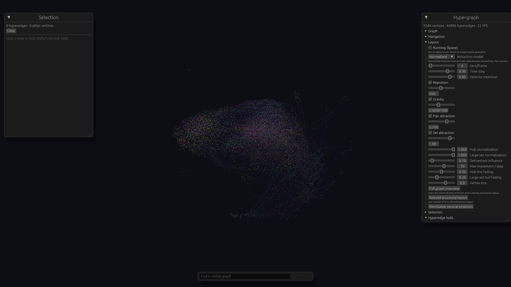

# Module explorer validation — 2026-10-03

Validated in the native managed worktree on Apple M5 Pro, 24 GiB RAM,
macOS 27.0, Metal. No dependency versions or the declared Rust 1.89 floor
were changed. Commands below use the installed Rust 1.96 toolchain compatible
with the existing lockfile. The Rust 1.89 CI configuration was not exercised
locally; CI remains responsible for that configuration.

## Structural Spatial follow-up

The prior complete view still collapsed into a radial ball: pair imports and
larger derived dependency sets shared one unnormalized centroid force, while
subject-based seeds added apparent structure unrelated to connectivity. The
umbrella `Mathlib` imports 8,531 modules (22.84% of import lines); its dependency
group contains 8,532 members. Simply weakening gravity did not address this.

Large star-import scenes now use Normalized attraction, independent pair/set
weights and degree/arity normalization. Connectivity-only spectral initialization
uses a sparse normalized incidence operator, removes component stationary modes,
and iterates three vectors 256 times. Robust median-axis scaling, radial
compression and neutral fine jitter address localized branch modes. Startup
performs 64 actual bounded force steps and pauses; the UI provides Legacy,
Normalized and LinLog models plus Rebuild. All original vertices, imports and
sets remain. Extra hub/arity opacity fading can be disabled and is bypassed for
hovered/selected relationships. [Controls](../mathlib-demo.md#full-spatial-overview).

Verification passes **82 core + 77 native + 3 doctests = 162 Rust tests**, all
4 exporter tests, workspace/all-target clippy with warnings denied, formatting,
and both CLI and example release builds. Regressions observed RED before fixes
include topology/persistence APIs, sparse-tail core compression (median radius
25.6), displacement limiting (mutation test), and empty AABB-corner camera
padding (501.8 instead of the intended 280–310). Planted communities with a
universal hub separate; changing all vertex labels/kinds leaves structural
positions identical. Reordered IDs, disconnected/isolated nodes, empty input,
weight edits, normalized/LinLog literal pair dynamics and scene reloads are covered.

Independent final review found two important issues, both reproduced RED and
fixed with GREEN regressions: explicit rebuilds now immediately resample hull
members/triangles while ordinary paused frames retain their cache; saved force
preferences now apply before generating the paused startup geometry. The full
162-test suite passes after these fixes. No findings remain deferred.

### Mathlib comparison

```sh
target/release/examples/compare_layouts target/mathlib/graph.json \
  target/structural-comparison-scaled 800
```

Each candidate uses all 9,384 vertices and 44,906 hyperedges, the same stable-ID
neutral seeds where applicable, and 800 force steps. Configurations use repulsion
500, legacy gravity `0.001`/centroid `0.0005`, or structural gravity `0.00001` and the
published normalized weights. Internal-import mean distance is divided by mean
distance for up to 10,000 deterministic sampled pairs of distinct `Mathlib.*` modules.
The subject ratio compares mean distance for equal versus different node kinds
in that sample. Lower values indicate local/group coherence, not proof of
communities. Category metadata enters evaluation only, never the initializer.

| Candidate | Internal import / sampled pair | Same / different subject |
|---|---:|---:|
| Legacy, neutral seeds | 0.7101 | 0.9714 |
| Normalized, neutral seeds | 0.3301 | 0.7817 |
| LinLog, neutral seeds | 0.4424 | 0.9212 |
| LinLog, structural seeds | 0.2260 | 0.5714 |
| Normalized, structural seeds | **0.2213** | **0.5598** |

The Normalized structural candidate initializes in 109.4 ms and takes 10.62 s
including 800 steps in this headless run. These 800-step metrics are distinct
from the 64-step native startup image and depend on this graph/settings.

### Native full graph

```sh
HYPER_VIZ_SESSION=off target/release/examples/module_benchmark \
  target/mathlib/graph.json Mathlib.Init \
  target/module-validation/structural-spatial-markers spatial
```

The final native run retains all 9,384 vertices and 44,906 hyperedges, enables all
37,356 import lines (budget 0) and 7,550 group hulls, and pauses after 64 refinement
steps. At 1920 × 1080 / scale 1, after 60 startup frames, 180 measured wall-frame intervals
give **33.593 ms median, 43.380 ms p95** (about 30 FPS by the median). Rebuild took
approximately 973 ms. The PNG was inspected: subject-colored concentrations and
branches appear without label-based seeding; the new controls are exposed, all
geometry is framed and the optional explorer is unused. Native validation exited
successfully. The headless comparison had finished before this measurement.



Remaining limits: this is a three-coordinate approximate connectivity embedding,
with robust scaling and compression that distort literal distances. It does not
recover every community or encode directed dependency depth. Dense overlap remains;
orbit/zoom and the opacity controls help inspect it. Hulls keep the existing
24-member surface approximation. The benchmark measures paused rendering,
not force simulation, pointer interaction or a guaranteed frame rate. Native
Bevy logs retain the existing auxiliary-camera warning and Metal bindless warning;
rendering and capture succeeded.

## Earlier Full Spatial controls follow-up

The user's clarified goal is the complete spatial graph with useful controls.
Auto now stays Spatial for every graph; a saved dependency mode does not activate
the optional explorer. It remains available explicitly through `--view dependencies`.
The full overview enables every import line and hull, uses low opacity, pauses
layout, and frames immediately without waiting for force iterations. Logarithmic
force ranges and eight-decimal numeric entry expose the tiny gravity/centroid
values needed by the star projection. The controls are visible on startup for
large graphs. [Usage and ranges](../mathlib-demo.md#full-spatial-overview).

Final follow-up verification passes 72 core tests, 72 viewer tests, and 3 doctests
(147 Rust tests), workspace clippy with warnings denied, formatting, and a release
workspace build. Additional regressions failed before their fixes: Auto opening
the dependency canvas, the overview hiding geometry, a paused layout not framing,
and losing the return button in an explicitly opened explorer. The optional
dependency workflow remains covered by the existing actual-egui selection/path test.

```sh
HYPER_VIZ_SESSION=off target/release/examples/module_benchmark \
  target/mathlib/graph.json Mathlib.Init target/module-validation/full-spatial-framed spatial
```

The corrected native run displays all 9,384 vertices and 44,906 hyperedges:
37,356 import lines without budget omissions and 7,550 enabled group hulls. Layout
is paused at deterministic initial positions. At 1920 × 1080 / scale factor 1,
180 measured wall-frame intervals after 60 startup frames give **39.667 ms median
and 49.071 ms p95** (about 25 FPS by the median). The screenshot was inspected:
the whole structure is framed, the Spatial controls are exposed, and no explorer
sidebar or mode strip appears. Native validation exited successfully.

This complete geometry run does not meet 30 FPS; it is a different workload from
the bounded dependency canvas measured below. It does not measure running force
simulation or active user input. Opacity reduces visual clutter while all surfaces
still incur rendering work, and the existing 24-member hull approximation remains.

The remaining sections record the earlier optional explorer validation.

## Correctness

The final debug workspace suite passes 72 core tests, 68 viewer tests, and
3 doctests. The exporter passes all 4 Python tests. Formatting, clippy for all
workspace targets with warnings denied, and a release workspace build pass.

```sh
CARGO_PROFILE_DEV_DEBUG=0 CARGO_PROFILE_TEST_DEBUG=0 CARGO_INCREMENTAL=0 \
  cargo +1.96.0 test --workspace --offline
CARGO_PROFILE_DEV_DEBUG=0 CARGO_INCREMENTAL=0 \
  cargo +1.96.0 clippy --workspace --all-targets --offline -- -D warnings
cargo +1.96.0 fmt --all -- --check
cargo +1.96.0 build --release --workspace --offline
python3 -m unittest discover -s scripts -p 'test_*.py'
git diff --check
```

Disabling debug information reduced local build storage; test assertions remained
active. The upstream `block` crate emits its existing future compatibility notice.

Coverage includes validated import direction, malformed metadata, duplicate edges,
cycles, self-loops, independent depth traversal, filtering through intermediate
modules, deterministic truncation, explicit path inclusion, stable layout rows,
exact selection through the actual egui panel, session normalization and scene
reordering, mode changes, spatial scope transfer, visible-only picking, and frozen
hull mesh asset events. Regression tests failed before their fixes. Temporarily
restoring unconditional hull rebuilds and filtered-list row assignment each made
the corresponding regression fail again.

Independent final review found no remaining important findings. Review fixes
cover stale spatial selections during dependency-mode reloads, chosen-mode
preservation, filtered expansion seeds, fresh-session presets, displayed path
steps beyond initial depth, path expansion order, and cinematic opacity.

## Actual Mathlib scope

The pinned v4.34.1 graph contains 9,384 vertices, 37,356 directed imports, and
7,550 dependency groups. `Mathlib.Topology.Basic` has exactly three direct imports
and four direct dependents. The default canvas displays eight modules including
the center and twelve induced directed edges. The 8,532-member umbrella group
cannot enlarge this directed scope.

`Mathlib.Init` has 35 direct imports and 214 direct dependents. Including the
center yields 250 reachable modules: the default 200-module budget reports
50 omitted modules with all categories included.

## Native measurement

The normal native dependency UI was measured independently of the scripted tour.
The release example uses a 1920 × 1080 window, scale factor 1, normal presentation,
and continuous updates. Sessions are disabled. It discards 60 startup frames,
records 180 wall-clock frame intervals, and captures one screenshot at frame 90.
The readback is included in those samples. No synthetic input is injected during
the measured frames.

```sh
cargo +1.96.0 build --release -p hyper-viz-bevy \
  --example module_benchmark --offline
HYPER_VIZ_SESSION=off target/release/examples/module_benchmark \
  target/mathlib/graph.json Mathlib.Init target/module-validation/final-200
```

| Scope | Budget omissions | Median frame | p95 frame |
|---|---:|---:|---:|
| Mathlib.Init, 200 displayed modules | 50 | 8.312 ms | 9.635 ms |

This run satisfies the 33.3 ms/frame target under these steady-state conditions.
It does not establish a hardware-independent guarantee or measure interactions
such as searching, changing scope, and zooming. The canvas clips offscreen
geometry and reduces labels when zoomed out; hover details and neighbor lists
preserve access to full module IDs.

Screenshots were inspected for both the eight-module Topology scope and the
200-module Init scope. A separate native run of `fixtures/sample.json` in Auto
mode confirmed that the generic coauthorship graph opens in Spatial mode with
its nodes, labels, lines, and hulls. That Spatial validation wrote its report and
screenshot but required process termination after requesting AppExit; clean
native Spatial shutdown is not established by this check.

Generated PNGs and raw frame CSVs remain under ignored `target/module-validation/`.
The example reproduces them rather than committing machine-specific build output.

## Execution notes

Scene metadata and optional hubs were committed first, followed by the pure
Rust dependency index. Native state, canvas, session restoration, mode gates,
and spatial visibility share interfaces and were delivered together after the
individual regression checks. Final debug verification supplements the earlier
release-profile checks. Public scene struct literals now require the additive
attribute fields and an optional hub index; legacy JSON remains defaulted and
session format version stays `hyperviz.session.v1`.
